# 🧠 云原生核心概念详解

> 深入理解云原生技术的基础概念和核心原理

## 📖 目录

- [什么是云原生](#什么是云原生)
- [容器化技术](#容器化技术)
- [微服务架构](#微服务架构)
- [容器编排](#容器编排)
- [服务网格](#服务网格)
- [可观测性](#可观测性)
- [DevOps和CI/CD](#devops和cicd)
- [基础设施即代码](#基础设施即代码)
- [云原生安全](#云原生安全)

---

## 🌤️ 什么是云原生

### 定义

**云原生**是一套技术体系和方法论，专门为在云计算环境中构建和运行可弹性扩展的应用而设计。

### CNCF官方定义

> 云原生技术有利于各组织在公有云、私有云和混合云等新型动态环境中，构建和运行可弹性扩展的应用。云原生的代表技术包括容器、服务网格、微服务、不可变基础设施和声明式API。

### 核心特征

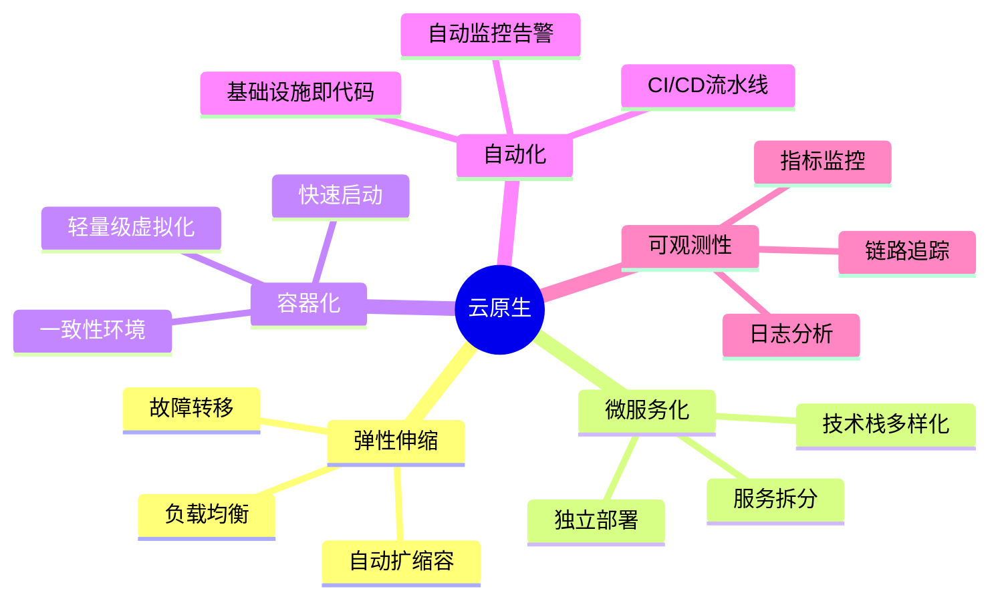

### 云原生的优势

| 传统应用 | 云原生应用 | 优势 |
|----------|-----------|------|
| 单体架构 | 微服务架构 | 更好的可维护性和扩展性 |
| 手动部署 | 自动化CI/CD | 更快的发布速度和更高的质量 |
| 静态配置 | 动态伸缩 | 更好的资源利用率 |
| 有限监控 | 全面可观测性 | 更快的问题发现和解决 |

---

## 📦 容器化技术

### 容器 vs 虚拟机

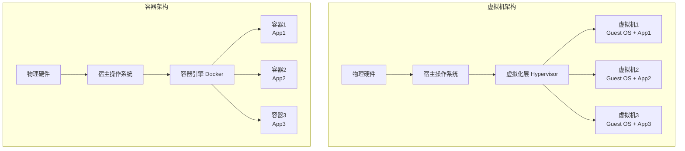

### 容器核心概念

#### 1. Linux命名空间 (Namespaces)

为进程提供隔离的执行环境：

| 命名空间类型 | 隔离内容 | 作用 |
|-------------|----------|------|
| **PID** | 进程ID | 容器内进程看不到宿主机其他进程 |
| **NET** | 网络 | 容器拥有独立的网络栈 |
| **IPC** | 进程间通信 | 隔离信号量、消息队列等 |
| **MNT** | 文件系统挂载点 | 容器拥有独立的文件系统视图 |
| **UTS** | 主机名和域名 | 容器可以有独立的主机名 |
| **USER** | 用户和用户组 | 用户ID映射和权限隔离 |

#### 2. 控制组 (Cgroups)

资源限制和监控：

```bash
# CPU限制示例
docker run --cpus="1.5" nginx

# 内存限制示例  
docker run --memory="512m" nginx

# IO限制示例
docker run --device-read-bps /dev/sda:1mb nginx
```

#### 3. 容器镜像

**分层存储架构**：

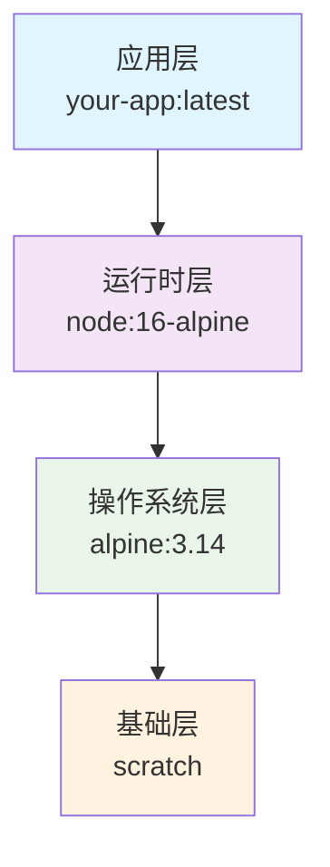

**写时复制（COW）机制**：
- 多个容器共享相同的镜像层
- 只有在写入时才创建新的层
- 大幅减少存储空间和启动时间

### Docker核心组件

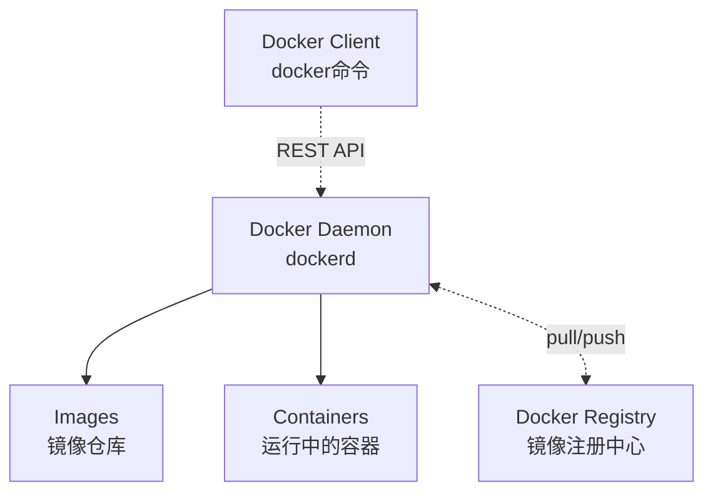

---

## 🏗️ 微服务架构

### 微服务 vs 单体架构

#### 单体架构
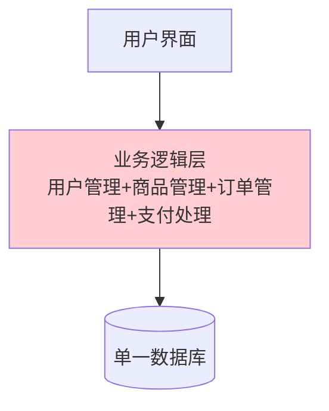

#### 微服务架构
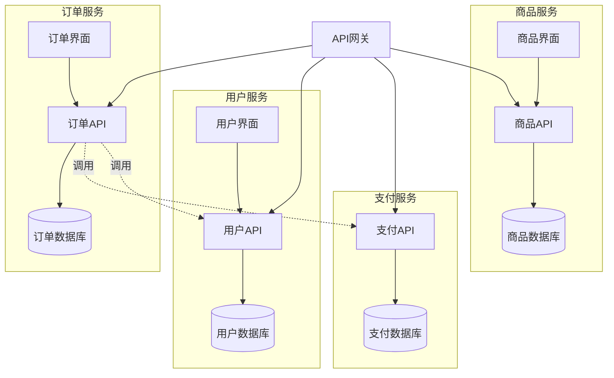

### 微服务设计原则

#### 1. 单一职责原则
每个微服务只负责一个业务功能：
- ✅ 用户服务只处理用户相关操作
- ✅ 订单服务只处理订单相关操作
- ❌ 避免一个服务处理多个不相关的业务

#### 2. 服务自治
```yaml
# 微服务自治特征
independence:
  data: "每个服务拥有独立的数据库"
  deployment: "可以独立部署和升级"
  scaling: "可以独立扩缩容"
  technology: "可以选择不同的技术栈"
  team: "可以由不同团队维护"
```

#### 3. 去中心化治理
- **数据去中心化**：每个服务管理自己的数据
- **技术去中心化**：服务可以选择最适合的技术栈
- **治理去中心化**：服务团队拥有技术决策权

### 微服务间通信

#### 同步通信
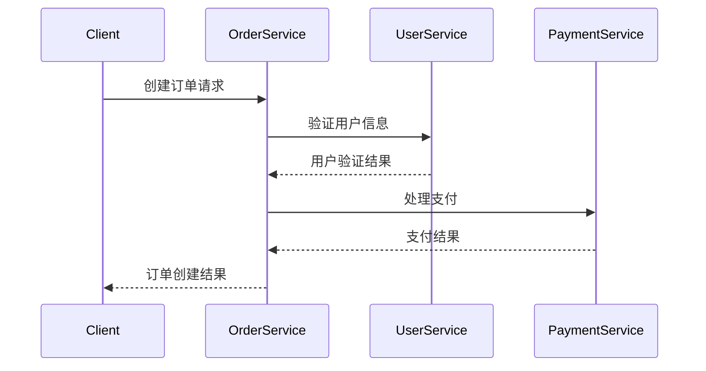

#### 异步通信
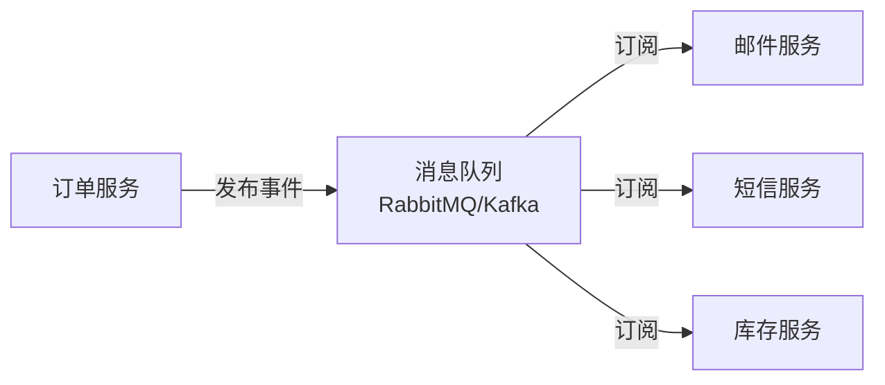

---

## ⚙️ 容器编排

### 为什么需要容器编排

单独使用Docker的限制：
- ❌ 手动管理大量容器
- ❌ 容器故障后需要手动重启
- ❌ 负载均衡需要额外配置
- ❌ 滚动更新困难
- ❌ 配置管理复杂

### Kubernetes架构

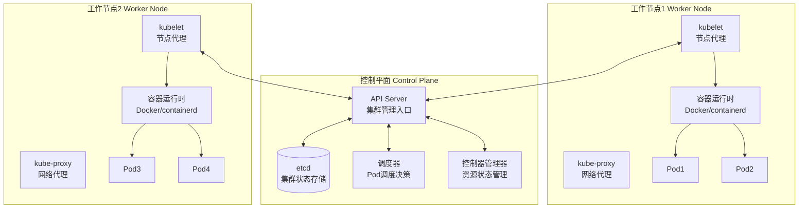

### Kubernetes核心概念

#### 1. Pod - 最小部署单元
```yaml
apiVersion: v1
kind: Pod
metadata:
  name: web-app
  labels:
    app: web
spec:
  containers:
  - name: web-container
    image: nginx:1.20
    ports:
    - containerPort: 80
    resources:
      requests:
        memory: "64Mi"
        cpu: "250m"
      limits:
        memory: "128Mi"
        cpu: "500m"
```

**Pod特征**：
- Pod内容器共享网络和存储
- Pod是原子调度单位
- Pod通常只包含一个主容器

#### 2. Deployment - 应用部署管理
```yaml
apiVersion: apps/v1
kind: Deployment
metadata:
  name: web-deployment
spec:
  replicas: 3
  selector:
    matchLabels:
      app: web
  template:
    metadata:
      labels:
        app: web
    spec:
      containers:
      - name: web
        image: nginx:1.20
        ports:
        - containerPort: 80
```

**Deployment功能**：
- 管理Pod副本数量
- 滚动更新和回滚
- 扩缩容管理
- 自愈能力

#### 3. Service - 服务发现
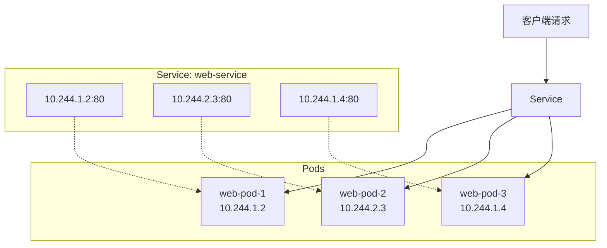

#### Service类型对比

| Service类型 | 用途 | 访问方式 | 适用场景 |
|------------|------|----------|----------|
| **ClusterIP** | 集群内访问 | 集群内IP | 微服务间通信 |
| **NodePort** | 节点端口访问 | 节点IP:NodePort | 开发测试环境 |
| **LoadBalancer** | 云负载均衡器 | 外部IP | 生产环境外部访问 |
| **ExternalName** | 外部服务映射 | DNS名称 | 访问外部服务 |

---

## 🕸️ 服务网格

### 什么是服务网格

**服务网格（Service Mesh）**是一个专门处理服务间通信的基础设施层，通过边车代理（Sidecar Proxy）模式为微服务提供通信、安全、观测等能力。

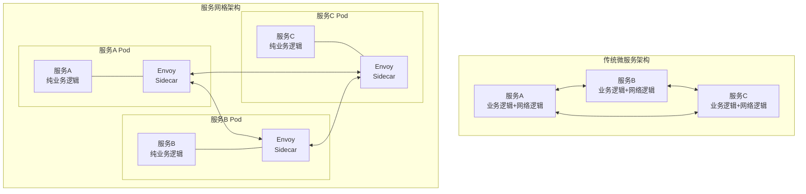

### Istio架构

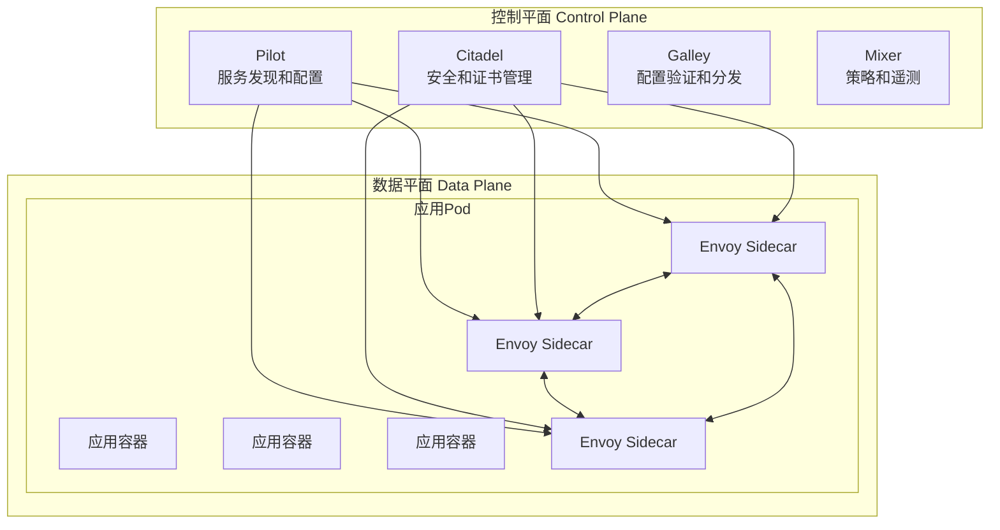

### 服务网格核心功能

#### 1. 流量管理
```yaml
# 虚拟服务配置示例
apiVersion: networking.istio.io/v1alpha3
kind: VirtualService
metadata:
  name: reviews
spec:
  hosts:
  - reviews
  http:
  - match:
    - headers:
        end-user:
          exact: jason
    route:
    - destination:
        host: reviews
        subset: v2
  - route:
    - destination:
        host: reviews
        subset: v1
```

#### 2. 安全策略
```yaml
# mTLS策略配置
apiVersion: security.istio.io/v1beta1
kind: PeerAuthentication
metadata:
  name: default
spec:
  mtls:
    mode: STRICT
```

#### 3. 可观测性
- **指标收集**：自动收集HTTP、gRPC、TCP指标
- **分布式追踪**：请求调用链自动追踪
- **访问日志**：详细的请求访问记录

---

## 📊 可观测性

### 可观测性三大支柱

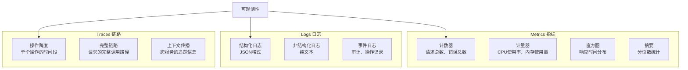

### 监控架构设计

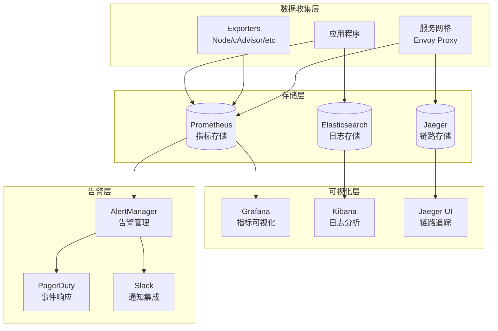

### 四个黄金信号

| 信号 | 定义 | 监控指标 | 告警阈值示例 |
|------|------|----------|-------------|
| **延迟 Latency** | 请求响应时间 | P50、P95、P99响应时间 | P95 > 500ms |
| **流量 Traffic** | 请求速率 | QPS、RPS | QPS下降 > 50% |
| **错误 Errors** | 错误率 | 4xx、5xx错误率 | 错误率 > 5% |
| **饱和度 Saturation** | 资源使用率 | CPU、内存、磁盘使用率 | CPU > 80% |

---

## 🔄 DevOps和CI/CD

### DevOps文化

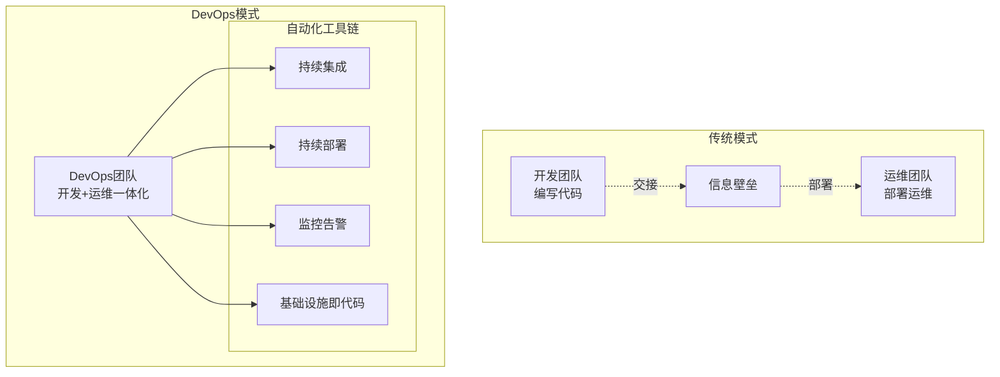

### CI/CD流水线

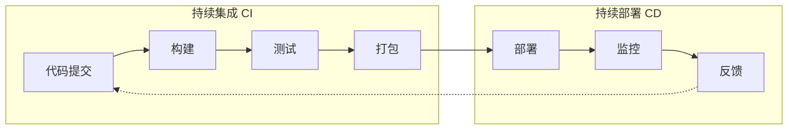

#### 流水线阶段详解

1. **代码质量检查**
   ```yaml
   stages:
     - lint: "ESLint、Pylint静态代码分析"
     - security: "安全漏洞扫描"
     - coverage: "测试覆盖率检查"
   ```

2. **自动化测试**
   ```yaml
   test_pyramid:
     unit_tests: "单元测试 - 70%"
     integration_tests: "集成测试 - 20%"
     e2e_tests: "端到端测试 - 10%"
   ```

3. **部署策略**
   - **蓝绿部署**：零停机时间部署
   - **金丝雀发布**：渐进式流量切换
   - **滚动更新**：逐步替换旧版本

---

## 🏗️ 基础设施即代码

### IaC的优势

| 传统方式 | 基础设施即代码 | 优势 |
|----------|---------------|------|
| 手动配置服务器 | 代码定义基础设施 | 可重复、一致性 |
| 文档记录配置 | 代码即文档 | 自动化、版本控制 |
| 手动备份恢复 | 自动化部署 | 快速恢复、灾难恢复 |
| 环境差异 | 环境一致性 | 减少"在我机器上能运行"问题 |

### IaC工具对比

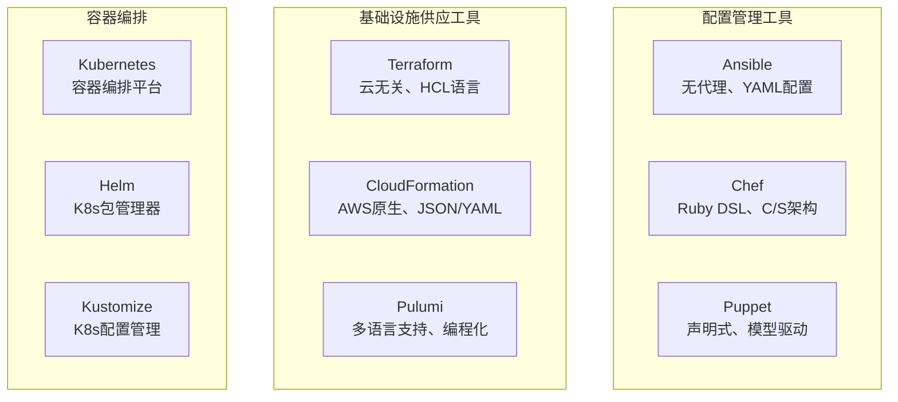

### Terraform示例

```hcl
# 定义云提供商
provider "aws" {
  region = "us-west-2"
}

# 创建VPC
resource "aws_vpc" "main" {
  cidr_block           = "10.0.0.0/16"
  enable_dns_hostnames = true
  enable_dns_support   = true
  
  tags = {
    Name = "main-vpc"
    Environment = "production"
  }
}

# 创建EKS集群
resource "aws_eks_cluster" "main" {
  name     = "main-cluster"
  role_arn = aws_iam_role.cluster.arn
  version  = "1.21"

  vpc_config {
    subnet_ids = aws_subnet.private[*].id
  }
}
```

---

## 🔒 云原生安全

### 安全模型：深度防御

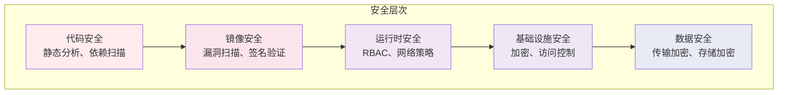

### Kubernetes安全最佳实践

#### 1. RBAC权限控制
```yaml
# 角色定义
apiVersion: rbac.authorization.k8s.io/v1
kind: Role
metadata:
  name: pod-reader
rules:
- apiGroups: [""]
  resources: ["pods"]
  verbs: ["get", "watch", "list"]

---
# 角色绑定
apiVersion: rbac.authorization.k8s.io/v1
kind: RoleBinding
metadata:
  name: read-pods
subjects:
- kind: User
  name: jane
  apiGroup: rbac.authorization.k8s.io
roleRef:
  kind: Role
  name: pod-reader
  apiGroup: rbac.authorization.k8s.io
```

#### 2. 网络策略
```yaml
apiVersion: networking.k8s.io/v1
kind: NetworkPolicy
metadata:
  name: deny-all
spec:
  podSelector: {}
  policyTypes:
  - Ingress
  - Egress
  # 默认拒绝所有流量
```

#### 3. Pod安全策略
```yaml
apiVersion: v1
kind: Pod
metadata:
  name: secure-pod
spec:
  securityContext:
    runAsNonRoot: true
    runAsUser: 1000
    fsGroup: 2000
  containers:
  - name: app
    image: myapp:latest
    securityContext:
      allowPrivilegeEscalation: false
      readOnlyRootFilesystem: true
      capabilities:
        drop:
        - ALL
```

### 零信任安全架构

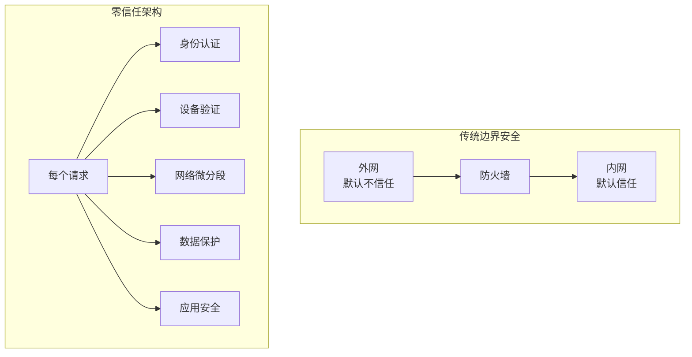

---

## 📚 总结

云原生技术体系是一个复杂但强大的技术栈，它通过以下核心概念和技术，帮助组织构建现代化的、可扩展的、弹性的应用程序：

### 核心技术栈

1. **容器化**：Docker提供应用打包和隔离
2. **编排**：Kubernetes管理容器生命周期
3. **服务网格**：Istio处理服务间通信
4. **监控**：Prometheus+Grafana提供可观测性
5. **CI/CD**：自动化部署流水线
6. **安全**：多层防护和零信任架构

### 学习建议

- 🚀 **循序渐进**：从Docker开始，逐步深入Kubernetes
- 🛠️ **动手实践**：理论结合实际项目
- 🔄 **持续学习**：云原生技术快速发展，需要持续跟进
- 🤝 **社区参与**：参与开源项目和技术社区

记住，掌握云原生技术不是一蹴而就的过程，需要时间、实践和耐心。但一旦掌握，您将具备构建现代化应用的强大能力！ 💪