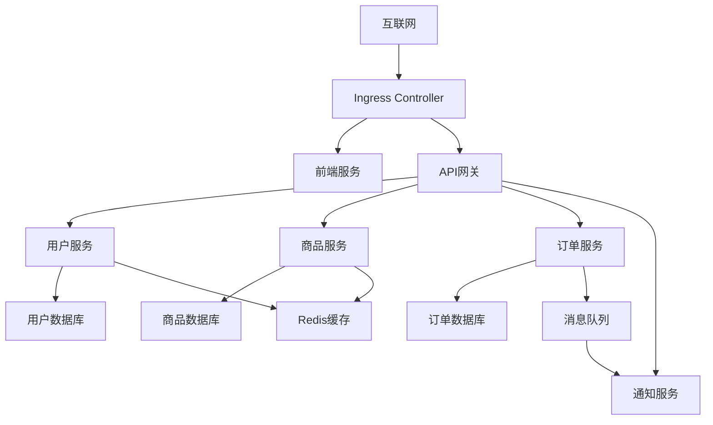

# 📋 云原生学习路线图详细计划

> 为期3-4个月的云原生全栈技能学习路径，专为有编程基础的开发者设计

## 🎯 总体目标

通过14周的系统性学习，从云原生零基础达到能够独立设计、部署和维护生产级云原生应用的水平。

## 📊 学习时间分配

```mermaid
gantt
    title 云原生学习路线图时间线
    dateFormat X
    axisFormat 第%d周

    section 第一阶段：容器化基础
    Docker基础           :a1, 0, 7d
    Docker Compose       :a2, after a1, 7d
    容器化实践项目        :a3, after a2, 7d

    section 第二阶段：容器编排
    Kubernetes基础       :b1, after a3, 14d
    服务发现与负载均衡    :b2, after b1, 7d
    微服务部署实践       :b3, after b2, 7d

    section 第三阶段：监控与可观测性
    监控体系构建         :c1, after b3, 14d
    日志与链路追踪       :c2, after c1, 7d

    section 第四阶段：生产级实践
    安全与治理           :d1, after c2, 7d
    CI/CD流水线          :d2, after d1, 14d
```



---

## 🚀 第一阶段：容器化基础 (第1-3周)

### 🎯 阶段目标
- 理解容器化的核心概念和优势
- 熟练使用Docker进行应用容器化
- 掌握多容器应用的编排和管理

### 📅 第1周：Docker基础

#### 学习内容
- **容器技术原理** (2天)
  - 容器 vs 虚拟机的区别
  - Linux命名空间和控制组
  - 容器镜像和分层存储原理

- **Docker核心概念** (3天)
  - Docker架构：守护进程、客户端、镜像、容器
  - Dockerfile编写最佳实践
  - 镜像构建和优化技巧

- **Docker基础操作** (2天)
  - 容器生命周期管理
  - 数据卷和网络配置
  - 镜像仓库使用

#### 实践任务
```bash
# 任务1：容器化一个简单的Web应用
docker build -t my-web-app .
docker run -d -p 8080:80 my-web-app

# 任务2：多阶段构建优化镜像大小
# 编写多阶段Dockerfile，将应用镜像大小减少50%以上
```

#### 学习检查点
- [ ] 能够解释容器化的核心原理
- [ ] 独立编写Dockerfile并构建镜像
- [ ] 熟练使用Docker CLI进行容器管理
- [ ] 理解Docker网络和存储概念

### 📅 第2周：Docker Compose

#### 学习内容
- **多容器应用编排** (3天)
  - Docker Compose概念和架构
  - YAML配置文件编写
  - 服务间通信和依赖管理

- **数据持久化和网络** (2天)
  - 数据卷的高级用法
  - 自定义网络配置
  - 环境变量和配置管理

- **开发工作流优化** (2天)
  - 开发环境Docker化
  - 热重载和调试技巧
  - 多环境配置管理

#### 实践任务
```yaml
# 任务：构建一个完整的Web应用栈
# - 前端：React/Vue应用
# - 后端：Node.js/Python API
# - 数据库：PostgreSQL/MySQL
# - 缓存：Redis
# - 反向代理：Nginx
```

#### 学习检查点
- [ ] 熟练编写docker-compose.yml文件
- [ ] 管理多容器应用的生命周期
- [ ] 配置服务间网络通信
- [ ] 实现数据持久化和备份

### 📅 第3周：容器化项目实践

#### 综合项目：电商微服务应用容器化

**项目需求**：
- 用户服务（用户注册、登录、个人信息管理）
- 商品服务（商品目录、搜索、详情）
- 订单服务（购物车、下单、支付）
- 通知服务（邮件、短信通知）

**技术栈**：
- 前端：React + Nginx
- 后端：选择熟悉的语言（Node.js/Python/Java/Go）
- 数据库：PostgreSQL
- 缓存：Redis
- 消息队列：RabbitMQ

#### 实践要求
1. **容器化所有服务组件**
2. **编写统一的Docker Compose配置**
3. **实现服务间通信和数据共享**
4. **配置开发和生产环境差异**
5. **编写详细的部署文档**

#### 交付物
- [ ] 完整的应用容器化代码
- [ ] Docker Compose配置文件
- [ ] 部署和运维文档
- [ ] 性能测试报告

---

## ⚙️ 第二阶段：容器编排 (第4-7周)

### 🎯 阶段目标
- 深入理解Kubernetes架构和核心概念
- 能够在Kubernetes上部署和管理微服务应用
- 掌握服务发现、负载均衡和配置管理

### 📅 第4-5周：Kubernetes基础

#### 学习内容
- **Kubernetes架构深入** (3天)
  - 控制平面组件：API Server、etcd、调度器
  - 节点组件：kubelet、kube-proxy、容器运行时
  - 插件生态：DNS、网络、存储

- **核心资源对象** (4天)
  - Pod：容器组的最小部署单元
  - Deployment：应用部署和滚动更新
  - Service：服务发现和负载均衡
  - ConfigMap和Secret：配置和密钥管理

- **集群管理** (3天)
  - 本地开发环境搭建（Minikube/Kind）
  - kubectl命令行工具使用
  - YAML配置文件编写和管理

#### 实践任务
```bash
# 任务1：搭建本地Kubernetes集群
minikube start --driver=docker --cpus=4 --memory=8192

# 任务2：部署第一个应用
kubectl create deployment nginx --image=nginx
kubectl expose deployment nginx --port=80 --type=NodePort

# 任务3：使用YAML配置文件管理资源
kubectl apply -f app-deployment.yaml
```

#### 学习检查点
- [ ] 理解Kubernetes核心架构
- [ ] 熟练使用kubectl管理集群资源
- [ ] 能够编写标准的Kubernetes YAML配置
- [ ] 掌握Pod、Deployment、Service的使用

### 📅 第6周：服务发现与负载均衡

#### 学习内容
- **服务发现机制** (2天)
  - Kubernetes内置DNS
  - Service类型和选择器
  - Endpoint和EndpointSlice

- **负载均衡策略** (2天)
  - kube-proxy实现原理
  - iptables vs IPVS模式
  - Session亲和性配置

- **Ingress网关** (3天)
  - Ingress Controller选择和安装
  - HTTP/HTTPS路由配置
  - SSL/TLS证书管理

#### 实践任务
```yaml
# 任务：为电商应用配置完整的网络访问
# - 内部服务使用ClusterIP Service
# - 外部访问通过Ingress Controller
# - 配置HTTPS和域名访问
```

#### 学习检查点
- [ ] 配置不同类型的Service
- [ ] 部署和配置Ingress Controller
- [ ] 实现HTTP/HTTPS路由规则
- [ ] 理解Kubernetes网络模型

### 📅 第7周：微服务部署实践

#### 综合项目：电商应用Kubernetes化

**部署架构图**：


#### 实践要求
1. **将第一阶段的容器化应用迁移到Kubernetes**
2. **配置适当的资源限制和健康检查**
3. **实现服务间的安全通信**
4. **配置持久化存储**
5. **实现应用的滚动更新**

#### 交付物
- [ ] 完整的Kubernetes配置文件
- [ ] 服务间通信测试报告
- [ ] 滚动更新演示
- [ ] 故障恢复测试文档

---

## 📊 第三阶段：监控与可观测性 (第8-10周)

### 🎯 阶段目标
- 构建完整的云原生应用监控体系
- 掌握指标采集、日志分析和链路追踪
- 实现智能告警和故障诊断

### 📅 第8-9周：监控体系建设

#### 学习内容
- **可观测性三大支柱** (2天)
  - Metrics（指标）：性能和业务指标
  - Logs（日志）：事件和错误记录
  - Traces（链路）：请求调用追踪

- **Prometheus生态** (4天)
  - Prometheus架构和数据模型
  - PromQL查询语言
  - Grafana可视化仪表板
  - AlertManager告警管理

- **监控指标设计** (3天)
  - 四个黄金信号：延迟、流量、错误、饱和度
  - 业务指标vs技术指标
  - SLI/SLO/SLA的定义和实施

- **Kubernetes监控** (5天)
  - 集群监控：节点、Pod、服务
  - 应用监控：自定义指标暴露
  - 资源监控：CPU、内存、网络、存储

#### 实践任务
```yaml
# 任务1：部署Prometheus监控栈
# - Prometheus Server
# - Grafana仪表板
# - AlertManager告警
# - Node Exporter节点监控

# 任务2：为电商应用添加监控
# - 业务指标：订单数量、用户注册数、收入
# - 技术指标：响应时间、错误率、吞吐量
```

#### 学习检查点
- [ ] 部署完整的Prometheus监控栈
- [ ] 编写PromQL查询语句
- [ ] 创建Grafana监控仪表板
- [ ] 配置智能告警规则

### 📅 第10周：日志与链路追踪

#### 学习内容
- **日志管理** (3天)
  - ELK/EFK Stack部署和配置
  - 日志收集：Fluentd/Fluent Bit
  - 日志存储：Elasticsearch
  - 日志查询：Kibana

- **链路追踪** (3天)
  - 分布式追踪原理
  - Jaeger部署和配置
  - OpenTelemetry标准
  - 微服务调用链分析

- **APM应用性能监控** (1天)
  - 应用性能指标
  - 错误追踪和分析
  - 性能瓶颈识别

#### 实践任务
```bash
# 任务：为电商应用建立完整的可观测性
# 1. 部署EFK日志栈
# 2. 集成Jaeger链路追踪
# 3. 应用埋点和指标采集
# 4. 创建统一的监控仪表板
```

#### 交付物
- [ ] 完整的日志收集和分析系统
- [ ] 分布式链路追踪系统
- [ ] 综合监控仪表板
- [ ] 告警规则和响应流程

---

## 🔒 第四阶段：生产级实践 (第11-14周)

### 🎯 阶段目标
- 掌握云原生安全最佳实践
- 构建自动化CI/CD流水线
- 实现基础设施即代码
- 具备生产环境运维能力

### 📅 第11周：安全与治理

#### 学习内容
- **Kubernetes安全** (3天)
  - RBAC权限控制
  - Pod安全策略
  - 网络策略和微分段
  - 密钥管理和轮换

- **容器安全** (2天)
  - 镜像安全扫描
  - 运行时安全监控
  - 最小权限原则
  - 安全基线配置

- **服务网格安全** (2天)
  - Istio安全架构
  - mTLS双向认证
  - 服务间访问控制
  - 安全策略自动化

#### 实践任务
```yaml
# 任务：为电商应用实施安全加固
# 1. 配置RBAC权限体系
# 2. 实施网络策略隔离
# 3. 集成镜像安全扫描
# 4. 部署服务网格安全
```

### 📅 第12-13周：CI/CD流水线

#### 学习内容
- **CI/CD原理和实践** (4天)
  - 持续集成：代码提交到可部署制品
  - 持续部署：自动化部署到各环境
  - GitOps工作流
  - 蓝绿部署和金丝雀发布

- **流水线工具** (3天)
  - GitLab CI/CD配置
  - GitHub Actions使用
  - Jenkins在Kubernetes中的部署
  - ArgoCD GitOps实践

- **制品管理** (2天)
  - 容器镜像仓库管理
  - Helm Chart打包和分发
  - 版本管理和回滚策略

- **多环境管理** (5天)
  - 开发、测试、预生产、生产环境
  - 配置管理和环境隔离
  - 自动化测试集成
  - 发布流程和审批机制

#### 实践任务
```yaml
# 综合任务：构建端到端CI/CD流水线
stages:
  - 代码检查：静态分析、安全扫描
  - 单元测试：测试覆盖率报告
  - 构建镜像：多架构镜像构建
  - 集成测试：自动化API测试
  - 部署测试环境：自动部署验证
  - 生产发布：金丝雀部署
  - 监控验证：自动化回滚
```

### 📅 第14周：综合项目实战

#### 最终项目：生产级云原生应用

**项目要求**：
将电商应用打造成企业级生产环境标准：

1. **架构优化**
   - 微服务拆分和治理
   - 数据一致性和分布式事务
   - 缓存策略和性能优化

2. **运维自动化**
   - 基础设施即代码（Terraform/Pulumi）
   - 自动化部署和回滚
   - 灾难恢复和备份策略

3. **监控和告警**
   - 全链路监控和告警
   - 性能基准和容量规划
   - 故障预测和自愈能力

4. **安全合规**
   - 安全扫描和漏洞管理
   - 数据加密和隐私保护
   - 审计日志和合规报告

#### 最终交付物
- [ ] 完整的生产级应用代码
- [ ] 基础设施即代码配置
- [ ] CI/CD流水线配置
- [ ] 监控和告警体系
- [ ] 安全策略和文档
- [ ] 运维手册和故障处理流程
- [ ] 项目总结和技术分享

---

## 🎓 学习成果评估

### 技能评估矩阵

| 技能领域 | 入门 | 进阶 | 熟练 | 专家 |
|----------|------|------|------|------|
| **容器化** | Docker基础操作 | 多容器编排 | 生产级配置 | 性能优化 |
| **编排管理** | Kubernetes基础 | 服务部署 | 集群管理 | 架构设计 |
| **监控运维** | 基础监控 | 告警配置 | 性能分析 | 智能运维 |
| **安全治理** | 基础安全 | 权限控制 | 安全扫描 | 合规管理 |
| **CI/CD** | 基础流水线 | 自动部署 | 多环境管理 | DevOps文化 |

### 认证建议

完成学习后，建议获取以下认证：
- **CKA (Certified Kubernetes Administrator)**
- **CKAD (Certified Kubernetes Application Developer)**
- **CKS (Certified Kubernetes Security Specialist)**

---

## 📚 后续学习方向

### 深度专精方向
- **服务网格**：Istio、Linkerd深入实践
- **云原生存储**：Rook、Longhorn存储解决方案
- **边缘计算**：KubeEdge、K3s轻量级部署
- **函数计算**：Knative、OpenFaaS Serverless

### 平台工程方向
- **多云管理**：Crossplane、Cluster API
- **开发者平台**：Backstage、Humanitec
- **策略即代码**：Open Policy Agent (OPA)
- **成本优化**：Kubernetes资源优化和成本控制

---

**记住**：这是一个密集的学习计划，需要每周投入20-30小时的学习时间。关键是动手实践，理论结合实际项目，才能真正掌握云原生技术栈！ 🚀