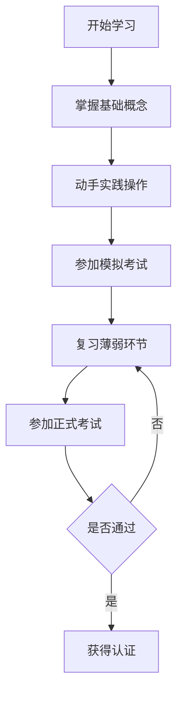

# 📖 云原生学习资源推荐

> 精心挑选的云原生学习资源，涵盖从入门到进阶的完整学习路径

## 📋 目录

- [官方文档](#官方文档)
- [在线课程](#在线课程)
- [技术书籍](#技术书籍)
- [视频教程](#视频教程)
- [实践平台](#实践平台)
- [博客和社区](#博客和社区)
- [播客和新闻](#播客和新闻)
- [开源项目](#开源项目)
- [认证考试](#认证考试)

---

## 📚 官方文档

### 容器化技术

#### Docker
- **官方文档**: [https://docs.docker.com/](https://docs.docker.com/)
- **最佳实践**: [Dockerfile最佳实践](https://docs.docker.com/develop/dev-best-practices/)
- **网络指南**: [Docker网络详解](https://docs.docker.com/network/)
- **存储管理**: [Docker数据卷](https://docs.docker.com/storage/)

#### Podman
- **官方文档**: [https://podman.io/getting-started/](https://podman.io/getting-started/)
- **对比Docker**: [Podman vs Docker](https://docs.podman.io/en/latest/markdown/podman.1.html)

### Kubernetes生态

#### Kubernetes核心
- **官方文档**: [https://kubernetes.io/docs/](https://kubernetes.io/docs/)
- **概念指南**: [Kubernetes基本概念](https://kubernetes.io/docs/concepts/)
- **任务指南**: [常见任务操作](https://kubernetes.io/docs/tasks/)
- **教程**: [官方学习教程](https://kubernetes.io/docs/tutorials/)

#### Helm包管理
- **官方文档**: [https://helm.sh/docs/](https://helm.sh/docs/)
- **Chart开发**: [Chart开发指南](https://helm.sh/docs/chart_template_guide/)
- **最佳实践**: [Helm最佳实践](https://helm.sh/docs/chart_best_practices/)

#### 服务网格 - Istio
- **官方文档**: [https://istio.io/latest/docs/](https://istio.io/latest/docs/)
- **概念介绍**: [Istio架构概念](https://istio.io/latest/docs/concepts/)
- **任务示例**: [实践任务](https://istio.io/latest/docs/tasks/)
- **性能和扩展性**: [性能优化指南](https://istio.io/latest/docs/ops/)

### 监控和可观测性

#### Prometheus
- **官方文档**: [https://prometheus.io/docs/](https://prometheus.io/docs/)
- **PromQL查询**: [查询语言指南](https://prometheus.io/docs/prometheus/latest/querying/)
- **告警规则**: [告警配置](https://prometheus.io/docs/alerting/latest/)

#### Grafana
- **官方文档**: [https://grafana.com/docs/](https://grafana.com/docs/)
- **仪表板**: [Dashboard设计指南](https://grafana.com/docs/grafana/latest/dashboards/)

#### Jaeger
- **官方文档**: [https://www.jaegertracing.io/docs/](https://www.jaegertracing.io/docs/)
- **架构指南**: [Jaeger架构](https://www.jaegertracing.io/docs/1.38/architecture/)

---

## 🎓 在线课程

### 免费课程

#### CNCF官方
- **[Introduction to Kubernetes](https://www.edx.org/course/introduction-to-kubernetes)** (edX)
  - 时长: 8-10小时
  - 难度: 入门
  - 内容: Kubernetes基础概念和操作

- **[Introduction to Cloud Infrastructure Technologies](https://www.edx.org/course/introduction-to-cloud-infrastructure-technologies)** (edX)
  - 时长: 6-8小时
  - 难度: 入门
  - 内容: 云基础设施技术概览

#### Kubernetes官方
- **[Kubernetes Basics](https://kubernetes.io/docs/tutorials/kubernetes-basics/)** (官方交互教程)
  - 时长: 2-3小时
  - 难度: 入门
  - 内容: 在线交互式Kubernetes学习

#### Cloud Native Computing Foundation
- **[Cloud Native Landscape](https://landscape.cncf.io/)** (技术生态图谱)
  - 内容: 云原生技术全景图
  - 用途: 了解技术生态和选型

### 付费优质课程

#### Udemy
- **[Docker Mastery: with Kubernetes +Swarm from a Docker Captain](https://www.udemy.com/course/docker-mastery/)**
  - 讲师: Bret Fisher
  - 时长: 19小时
  - 评分: 4.6/5
  - 价格: $84.99

- **[Kubernetes for the Absolute Beginners - Hands-on](https://www.udemy.com/course/learn-kubernetes/)**
  - 讲师: Mumshad Mannambeth
  - 时长: 6小时
  - 评分: 4.5/5
  - 价格: $84.99

#### A Cloud Guru
- **[Kubernetes Deep Dive](https://acloudguru.com/course/kubernetes-deep-dive)**
  - 时长: 8小时
  - 难度: 中级
  - 内容: Kubernetes深入理解

#### Pluralsight
- **[Docker and Kubernetes: The Big Picture](https://www.pluralsight.com/courses/docker-kubernetes-big-picture)**
  - 时长: 3小时
  - 难度: 入门
  - 内容: 容器和编排技术概览

### 专业培训

#### Linux Foundation
- **[Kubernetes Fundamentals (LFS258)](https://training.linuxfoundation.org/training/kubernetes-fundamentals/)**
  - 价格: $299
  - 时长: 自定进度
  - 认证: 为CKA考试准备

- **[Kubernetes for Developers (LFD259)](https://training.linuxfoundation.org/training/kubernetes-for-developers/)**
  - 价格: $299
  - 时长: 自定进度
  - 认证: 为CKAD考试准备

---

## 📖 技术书籍

### 入门级书籍

#### 《Docker实战》
- **作者**: Jeff Nickoloff, Stephen Kuenzli
- **出版社**: 人民邮电出版社
- **适合对象**: Docker初学者
- **核心内容**: Docker基础操作、镜像构建、网络配置

#### 《Kubernetes权威指南》
- **作者**: 龚正, 吴治辉, 王伟, 崔秀龙
- **出版社**: 电子工业出版社
- **适合对象**: Kubernetes初学者
- **核心内容**: K8s架构、核心概念、实践案例

### 进阶级书籍

#### 《Kubernetes in Action》
- **作者**: Marko Lukša
- **出版社**: Manning Publications
- **适合对象**: 有一定基础的开发者
- **核心内容**: K8s深度原理、高级特性、最佳实践

#### 《Cloud Native Patterns》
- **作者**: Cornelia Davis
- **出版社**: Manning Publications
- **适合对象**: 架构师和高级开发者
- **核心内容**: 云原生设计模式、架构原则

#### 《Building Microservices》
- **作者**: Sam Newman
- **出版社**: O'Reilly Media
- **适合对象**: 微服务架构设计者
- **核心内容**: 微服务设计原则、拆分策略、治理方案

### 专业级书籍

#### 《Production Kubernetes》
- **作者**: Josh Rosso, Rich Lander, Alex Brand, John Harris
- **出版社**: O'Reilly Media
- **适合对象**: 生产环境运维人员
- **核心内容**: 生产级K8s部署、运维、故障排除

#### 《Istio in Action》
- **作者**: Christian Posta, Rinor Maloku
- **出版社**: Manning Publications
- **适合对象**: 服务网格实践者
- **核心内容**: Istio架构、安全、流量管理

#### 《Prometheus Monitoring with Docker and Kubernetes》
- **作者**: Julien Pivotto
- **出版社**: Packt Publishing
- **适合对象**: 监控系统架构师
- **核心内容**: 监控体系设计、告警策略、性能优化

---

## 🎥 视频教程

### YouTube频道

#### TechWorld with Nana
- **频道**: [TechWorld with Nana](https://www.youtube.com/c/TechWorldwithNana)
- **特色**: 清晰的动画解释、实践项目
- **推荐视频**:
  - Docker Tutorial for Beginners
  - Kubernetes Tutorial for Beginners
  - DevOps Bootcamp

#### KodeKloud
- **频道**: [KodeKloud](https://www.youtube.com/c/KodeKloud)
- **特色**: 认证考试准备、动手实验
- **推荐视频**:
  - CKA Course Series
  - CKAD Course Series
  - Docker for Beginners

#### Cloud Native Computing Foundation
- **频道**: [CNCF](https://www.youtube.com/c/CloudNativeComputingFoundation)
- **特色**: 官方技术分享、KubeCon会议视频
- **推荐内容**:
  - KubeCon + CloudNativeCon演讲
  - CNCF项目深度分析
  - 云原生技术趋势分享

### 中文视频资源

#### 阿里云开发者
- **平台**: 优酷、B站
- **特色**: 中文讲解、阿里云实践
- **推荐系列**:
  - Kubernetes实战系列
  - 云原生技术公开课
  - 容器技术分享

#### 腾讯云开发者
- **平台**: 腾讯视频、B站
- **特色**: 腾讯云生态、实战案例
- **推荐内容**:
  - TKE实践教程
  - 微服务架构设计
  - DevOps实践分享

---

## 🛠️ 实践平台

### 在线练习环境

#### Katacoda
- **网址**: [https://www.katacoda.com/](https://www.katacoda.com/)
- **特色**: 浏览器内的实验环境
- **课程内容**:
  - Docker实验
  - Kubernetes场景
  - DevOps工具练习

#### Play with Docker
- **网址**: [https://labs.play-with-docker.com/](https://labs.play-with-docker.com/)
- **特色**: 免费Docker环境
- **使用时长**: 4小时会话
- **适用场景**: Docker基础练习

#### Play with Kubernetes
- **网址**: [https://labs.play-with-k8s.com/](https://labs.play-with-k8s.com/)
- **特色**: 免费K8s集群
- **使用时长**: 4小时会话
- **适用场景**: Kubernetes实验

#### Kubernetes Playground
- **网址**: [https://kubernetes.io/docs/tutorials/kubernetes-basics/](https://kubernetes.io/docs/tutorials/kubernetes-basics/)
- **特色**: 官方交互教程
- **内容**: 逐步指导的K8s学习

### 编程挑战

#### KodeKloud Engineer
- **网址**: [https://engineer.kodekloud.com/](https://engineer.kodekloud.com/)
- **特色**: 真实环境挑战题
- **内容**:
  - DevOps任务挑战
  - Kubernetes问题解决
  - 系统管理练习

#### HackerRank DevOps
- **网址**: [https://www.hackerrank.com/domains/tutorials/10-days-of-statistics](https://www.hackerrank.com/)
- **特色**: 编程和运维结合
- **内容**: DevOps技能测试

### 云平台免费额度

#### AWS Free Tier
- **网址**: [https://aws.amazon.com/free/](https://aws.amazon.com/free/)
- **免费额度**: EKS集群免费12个月
- **适用**: AWS云原生服务实践

#### Google Cloud Platform
- **网址**: [https://cloud.google.com/free](https://cloud.google.com/free)
- **免费额度**: $300信用额度
- **适用**: GKE集群实验

#### Microsoft Azure
- **网址**: [https://azure.microsoft.com/free/](https://azure.microsoft.com/free/)
- **免费额度**: AKS免费管理
- **适用**: Azure容器服务

---

## 🌐 博客和社区

### 技术博客

#### 官方博客
- **[Kubernetes Blog](https://kubernetes.io/blog/)**: 官方技术更新和最佳实践
- **[Docker Blog](https://www.docker.com/blog/)**: Docker技术动态和案例分享
- **[CNCF Blog](https://www.cncf.io/blog/)**: 云原生生态发展动态

#### 个人技术博客
- **[Kelsey Hightower](https://github.com/kelseyhightower)**: Kubernetes核心贡献者
- **[Brendan Burns](https://twitter.com/brendandburns)**: Kubernetes联合创始人
- **[Tim Hockin](https://twitter.com/thockin)**: Kubernetes网络专家

#### 中文技术社区
- **[云原生社区](https://cloudnative.to/)**: 中国云原生技术社区
- **[K8s中文社区](https://www.kubernetes.org.cn/)**: Kubernetes中文资源
- **[Docker中文社区](http://www.docker.org.cn/)**: Docker技术交流

### 技术论坛

#### Stack Overflow
- **标签**: kubernetes, docker, cloud-native
- **用途**: 技术问题解答

#### Reddit
- **[r/kubernetes](https://www.reddit.com/r/kubernetes/)**: Kubernetes讨论社区
- **[r/docker](https://www.reddit.com/r/docker/)**: Docker技术社区
- **[r/devops](https://www.reddit.com/r/devops/)**: DevOps实践分享

#### 中文论坛
- **[V2EX](https://www.v2ex.com/)**: 技术节点讨论
- **[掘金](https://juejin.cn/)**: 技术文章分享
- **[思否](https://segmentfault.com/)**: 编程问答社区

---

## 🎙️ 播客和新闻

### 英文播客

#### The Changelog
- **网址**: [https://changelog.com/](https://changelog.com/)
- **特色**: 开源技术和社区故事
- **更新频率**: 每周

#### Kubernetes Podcast from Google
- **网址**: [https://kubernetespodcast.com/](https://kubernetespodcast.com/)
- **特色**: Kubernetes生态深度讨论
- **更新频率**: 每周

#### Cloud Native Podcast
- **特色**: 云原生技术趋势和案例
- **嘉宾**: 行业专家和项目维护者

### 技术新闻

#### Cloud Native Now
- **网址**: [https://cloudnativenow.com/](https://cloudnativenow.com/)
- **内容**: 云原生行业新闻和分析

#### The New Stack
- **网址**: [https://thenewstack.io/](https://thenewstack.io/)
- **内容**: 现代应用开发和部署

#### InfoQ
- **网址**: [https://www.infoq.com/](https://www.infoq.com/)
- **内容**: 企业软件开发技术和架构

### 中文播客

#### 字节跳动技术团队
- **平台**: 喜马拉雅、Apple Podcasts
- **内容**: 大规模系统实践经验

#### 阿里云技术分享
- **平台**: 钉钉直播、B站
- **内容**: 云原生技术实践案例

---

## 💻 开源项目

### 学习项目

#### Kubernetes Examples
- **仓库**: [https://github.com/kubernetes/examples](https://github.com/kubernetes/examples)
- **内容**: 官方示例和最佳实践
- **适用**: 学习K8s资源配置

#### Docker Awesome
- **仓库**: [https://github.com/veggiemonk/awesome-docker](https://github.com/veggiemonk/awesome-docker)
- **内容**: Docker相关工具和资源合集
- **适用**: 发现Docker生态工具

#### Cloud Native Landscape
- **仓库**: [https://github.com/cncf/landscape](https://github.com/cncf/landscape)
- **内容**: 云原生技术全景图
- **适用**: 了解技术生态

### 实践项目

#### microservices-demo
- **仓库**: [https://github.com/GoogleCloudPlatform/microservices-demo](https://github.com/GoogleCloudPlatform/microservices-demo)
- **内容**: 谷歌云原生微服务示例
- **技术栈**: Kubernetes, Istio, gRPC

#### sock-shop
- **仓库**: [https://github.com/microservices-demo/microservices-demo](https://github.com/microservices-demo/microservices-demo)
- **内容**: 微服务电商示例应用
- **特色**: 完整的微服务架构演示

#### k8s-device-plugin
- **仓库**: [https://github.com/NVIDIA/k8s-device-plugin](https://github.com/NVIDIA/k8s-device-plugin)
- **内容**: GPU资源管理插件
- **适用**: 学习设备插件开发

### 工具项目

#### kubectl-plugins
- **仓库**: [https://github.com/kubernetes-sigs/krew-index](https://github.com/kubernetes-sigs/krew-index)
- **内容**: kubectl插件生态
- **用途**: 扩展kubectl功能

#### helm-charts
- **仓库**: [https://github.com/helm/charts](https://github.com/helm/charts)
- **内容**: 社区维护的Helm Charts
- **用途**: 快速部署常用应用

---

## 🏆 认证考试

### Kubernetes认证

#### CKA (Certified Kubernetes Administrator)
- **组织**: Linux Foundation / CNCF
- **价格**: $395
- **有效期**: 3年
- **考试形式**: 在线实操考试
- **时长**: 2小时
- **通过分数**: 66%
- **主要内容**:
  - 集群安装和配置 (25%)
  - 工作负载和调度 (15%)
  - 服务和网络 (20%)
  - 存储 (10%)
  - 故障排除 (30%)

#### CKAD (Certified Kubernetes Application Developer)
- **组织**: Linux Foundation / CNCF
- **价格**: $395
- **有效期**: 3年
- **考试形式**: 在线实操考试
- **时长**: 2小时
- **通过分数**: 66%
- **主要内容**:
  - 应用设计和构建 (20%)
  - 应用部署 (20%)
  - 应用可观测性和维护 (15%)
  - 应用环境配置和安全 (25%)
  - 服务和网络 (20%)

#### CKS (Certified Kubernetes Security Specialist)
- **组织**: Linux Foundation / CNCF
- **价格**: $395
- **有效期**: 2年
- **前置要求**: 必须持有CKA认证
- **考试形式**: 在线实操考试
- **时长**: 2小时
- **通过分数**: 67%
- **主要内容**:
  - 集群安装 (10%)
  - 集群加固 (15%)
  - 系统加固 (15%)
  - 微服务漏洞最小化 (20%)
  - 供应链安全 (20%)
  - 监控、日志和运行时安全 (20%)

### 云平台认证

#### AWS认证
- **[AWS Certified Solutions Architect](https://aws.amazon.com/certification/certified-solutions-architect-associate/)**
  - 价格: $150
  - 适用: AWS云原生架构设计

- **[AWS Certified DevOps Engineer](https://aws.amazon.com/certification/certified-devops-engineer-professional/)**
  - 价格: $300
  - 适用: AWS DevOps实践

#### Google Cloud认证
- **[Google Cloud Professional Cloud Architect](https://cloud.google.com/certification/cloud-architect)**
  - 价格: $200
  - 适用: GCP架构设计

- **[Google Cloud Professional DevOps Engineer](https://cloud.google.com/certification/cloud-devops-engineer)**
  - 价格: $200
  - 适用: GCP DevOps实践

#### Azure认证
- **[Azure Solutions Architect Expert](https://docs.microsoft.com/en-us/learn/certifications/azure-solutions-architect/)**
  - 价格: $165
  - 适用: Azure架构设计

- **[Azure DevOps Engineer Expert](https://docs.microsoft.com/en-us/learn/certifications/devops-engineer/)**
  - 价格: $165
  - 适用: Azure DevOps实践

### 认证准备建议

#### 学习策略
1. **理论学习** - 通过官方文档掌握核心概念
2. **动手实践** - 在本地或云环境中反复练习
3. **模拟考试** - 使用Killer.sh等平台进行模拟
4. **知识查漏** - 针对薄弱环节强化学习

#### 推荐学习路径

---

## 🎯 学习建议

### 分阶段学习计划

#### 第一阶段：基础概念 (1-2周)
- 阅读官方文档了解核心概念
- 观看入门视频教程
- 完成在线交互教程

#### 第二阶段：动手实践 (2-4周)
- 搭建本地开发环境
- 完成基础实验和项目
- 参与开源项目贡献

#### 第三阶段：深入学习 (4-8周)
- 阅读进阶技术书籍
- 学习最佳实践和设计模式
- 构建完整的项目案例

#### 第四阶段：专业认证 (2-4周)
- 准备认证考试
- 参加模拟考试
- 获得专业认证

### 持续学习建议

1. **跟踪技术趋势** - 关注CNCF项目动态
2. **参与社区活动** - 参加meetup和会议
3. **分享学习成果** - 写博客和技术分享
4. **实际项目应用** - 在工作中实践所学知识

---

**📚 记住**：云原生技术发展迅速，持续学习和实践是掌握这些技术的关键。选择适合自己当前水平的资源，循序渐进地学习，并注重动手实践。祝您学习愉快！ 🚀