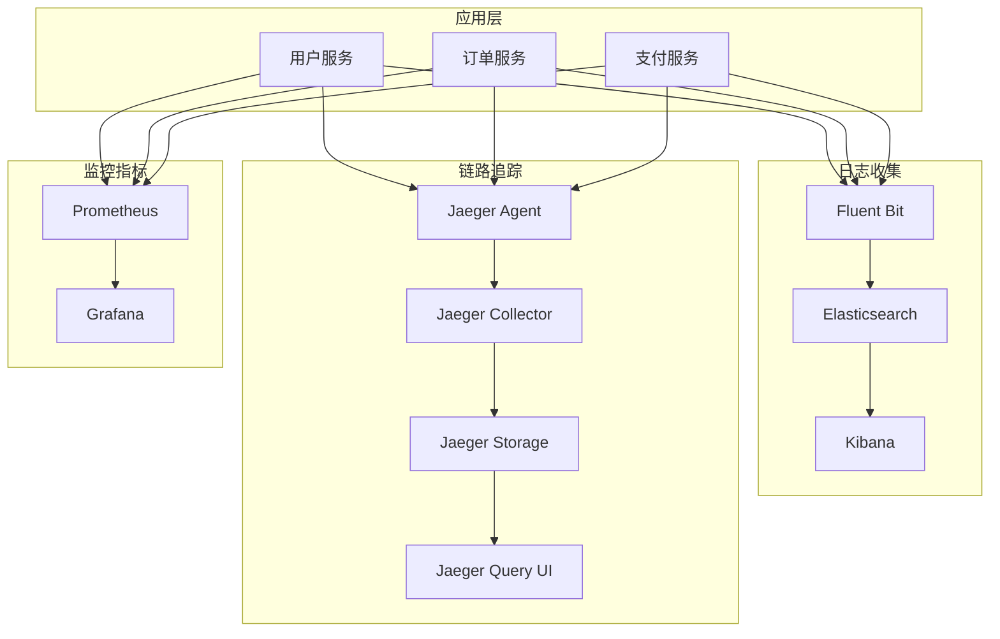

# 📊 日志收集与链路追踪系统实践

> 构建完整的云原生可观测性解决方案

## 📋 项目概述

本项目是云原生学习路径第三阶段的第二个实践项目，专注于使用 EFK Stack 和 Jaeger 构建完整的日志收集与分布式链路追踪系统。您将学习如何收集、存储、查询和分析微服务应用的日志数据和调用链信息。

## ✅ 项目状态

**当前状态**: 已完成并验证 ✅
- ✅ 完整的 EFK 日志收集栈部署
- ✅ Jaeger 分布式链路追踪系统
- ✅ 示例微服务应用集成
- ✅ 自动化部署和测试脚本
- ✅ 端到端功能验证通过

**验证结果**: 所有 16 项测试通过，成功率 100%

## 🎯 学习目标

完成本项目后，您将能够：

- **理解可观测性三大支柱**: 掌握指标、日志、链路追踪的关系
- **部署 EFK Stack**: 在 Kubernetes 中部署 Elasticsearch、Fluent Bit、Kibana
- **配置 Jaeger**: 部署和配置分布式链路追踪系统
- **应用埋点集成**: 为微服务应用添加日志和追踪埋点
- **统一可观测性**: 整合监控、日志、追踪三大数据源
- **故障诊断**: 使用可观测性数据进行问题定位和分析

## 🏗️ 项目架构



## 🏗️ 项目结构

```
logging-tracing/
├── README.md                    # 项目概览和快速开始
├── docs/                        # 📚 文档目录
│   ├── README.md               # 文档索引和导航
│   ├── guides/                 # 📖 使用指南
│   │   ├── scripts-usage-guide.md      # 脚本使用指南
│   │   ├── port-forward-guide.md       # 端口转发指南
│   │   └── dns-solution-guide.md       # DNS解决方案指南
│   ├── reports/                # 📊 项目报告
│   │   ├── verification-report.md      # 验证报告
│   │   ├── debugging-summary.md        # 调试总结
│   │   └── project-completion-summary.md # 项目完成总结
│   └── references/             # 📋 技术参考
│       ├── architecture.md             # 系统架构
│       ├── deployment-guide.md         # 部署指南
│       └── troubleshooting.md          # 故障排查
├── scripts/                     # 🔧 管理脚本
│   ├── setup.sh               # 一键部署脚本
│   ├── test.sh                # 功能测试脚本
│   ├── cleanup.sh             # 环境清理脚本
│   ├── port-forward.sh        # 端口转发管理
│   ├── fix-dns.sh             # DNS修复工具
│   └── generate-load.sh       # 负载生成脚本
├── manifests/                   # ⚙️ Kubernetes 配置
│   ├── elasticsearch/          # Elasticsearch 部署配置
│   ├── fluent-bit/             # Fluent Bit 日志收集配置
│   ├── kibana/                 # Kibana 可视化配置
│   ├── jaeger/                 # Jaeger 链路追踪配置
│   └── apps/                   # 示例应用配置
├── apps/                       # 💻 示例应用源码
│   └── user-service/           # Python Flask 用户服务
└── exercises/                  # 🎯 练习和实验
    └── basic/                  # 基础练习
```

## 🚀 快速开始

### 前置条件

- 运行中的 Kubernetes 集群
- kubectl 已配置并可访问集群
- 至少 8GB 可用内存
- 支持 PersistentVolume 的存储类
- 已部署 Prometheus + Grafana 监控栈

### 1. 环境准备

```bash
# 进入项目目录
cd projects/phase3-monitoring/logging-tracing

# 检查集群状态
kubectl cluster-info

# 创建日志命名空间
kubectl create namespace logging
kubectl create namespace tracing
```

### 2. 部署可观测性栈

```bash
# 进入脚本目录
cd scripts

# 一键部署完整可观测性栈
./setup.sh

# 验证部署状态
./test.sh
```

### 3. 访问管理界面

```bash
# 获取访问地址
kubectl get svc -n logging
kubectl get svc -n tracing

# 端口转发访问
kubectl port-forward -n logging svc/kibana 5601:5601
kubectl port-forward -n tracing svc/jaeger-query 16686:16686
```

### 4. 验证功能

```bash
# 运行测试脚本（在 scripts 目录中）
./test.sh

# 生成测试负载
./generate-load.sh

# 清理环境（可选）
./cleanup.sh
```

## 📚 学习路径

### 第一天：EFK 日志收集栈
1. **理论学习** (60分钟)
   - 日志收集架构设计
   - Elasticsearch 数据模型
   - Fluent Bit 配置原理

2. **环境部署** (90分钟)
   - 部署 Elasticsearch 集群
   - 配置 Fluent Bit 日志收集
   - 部署 Kibana 可视化

3. **基础练习** (60分钟)
   - 配置日志解析器
   - 创建索引模板
   - 设计日志查询

### 第二天：Jaeger 链路追踪
1. **追踪原理** (60分钟)
   - 分布式追踪概念
   - OpenTracing 标准
   - Jaeger 架构设计

2. **系统部署** (90分钟)
   - 部署 Jaeger 组件
   - 配置采样策略
   - 设置存储后端

3. **应用集成** (90分钟)
   - 添加追踪埋点
   - 配置上下文传播
   - 分析调用链数据

### 第三天：统一可观测性
1. **数据关联** (90分钟)
   - 关联日志和追踪
   - 统一时间戳处理
   - 跨系统数据查询

2. **仪表板集成** (90分钟)
   - 创建综合仪表板
   - 配置告警规则
   - 设计故障诊断流程

3. **性能优化** (60分钟)
   - 优化存储配置
   - 调整采样率
   - 监控系统性能

## 🔧 核心功能演示

### Fluent Bit 配置示例

```yaml
[SERVICE]
    Flush         1
    Log_Level     info
    Daemon        off
    Parsers_File  parsers.conf

[INPUT]
    Name              tail
    Path              /var/log/containers/*.log
    Parser            docker
    Tag               kube.*
    Refresh_Interval  5

[FILTER]
    Name                kubernetes
    Match               kube.*
    Kube_URL            https://kubernetes.default.svc:443
    Kube_CA_File        /var/run/secrets/kubernetes.io/serviceaccount/ca.crt
    Kube_Token_File     /var/run/secrets/kubernetes.io/serviceaccount/token

[OUTPUT]
    Name  es
    Match *
    Host  elasticsearch.logging.svc.cluster.local
    Port  9200
    Index fluentbit
```

### Jaeger 追踪示例

```python
from jaeger_client import Config
import opentracing

def init_tracer(service_name):
    config = Config(
        config={
            'sampler': {'type': 'const', 'param': 1},
            'logging': True,
        },
        service_name=service_name,
    )
    return config.initialize_tracer()

@app.route('/api/users')
def get_users():
    with opentracing.tracer.start_span('get_users') as span:
        span.set_tag('http.method', 'GET')
        span.set_tag('http.url', '/api/users')
        
        # 业务逻辑
        users = fetch_users_from_db()
        
        span.set_tag('user.count', len(users))
        return jsonify(users)
```

## 📊 可观测性数据类型

### 日志数据
- **应用日志**: 业务逻辑、错误信息、调试信息
- **访问日志**: HTTP 请求、响应时间、状态码
- **系统日志**: 容器启动、资源使用、系统事件

### 追踪数据
- **Span**: 单个操作的执行时间和上下文
- **Trace**: 完整的请求调用链
- **Tags**: 操作的元数据标签
- **Logs**: Span 内的结构化日志

### 关联分析
- **Trace ID 关联**: 通过 Trace ID 关联日志和追踪
- **时间窗口分析**: 基于时间范围的数据关联
- **错误分析**: 结合指标、日志、追踪的错误诊断

## 🔍 故障排查

### 常见问题
- Elasticsearch 集群状态异常
- Fluent Bit 无法收集日志
- Jaeger 无法接收追踪数据
- 数据关联和查询问题

### 排查工具
- Elasticsearch 集群健康检查
- Fluent Bit 日志输出调试
- Jaeger UI 追踪数据验证
- Kibana 查询性能分析

## 📝 验证检查点

### 基础功能验证
- [ ] Elasticsearch 集群正常运行
- [ ] Fluent Bit 正常收集日志
- [ ] Kibana 可以查询和可视化日志
- [ ] Jaeger 可以接收和显示追踪数据

### 高级功能验证
- [ ] 应用日志正确解析和索引
- [ ] 分布式追踪链路完整
- [ ] 日志和追踪数据可以关联
- [ ] 综合可观测性仪表板正常工作

### 性能验证
- [ ] 日志收集延迟可接受
- [ ] 追踪数据采样率合理
- [ ] 存储使用量可控
- [ ] 查询响应时间正常

## 🎉 项目完成标准

- [ ] 成功部署 EFK 日志收集栈
- [ ] 成功部署 Jaeger 链路追踪系统
- [ ] 配置微服务应用的日志和追踪埋点
- [ ] 创建综合可观测性仪表板
- [ ] 实现日志、追踪、指标的数据关联
- [ ] 完成所有基础和高级练习
- [ ] 能够独立排查可观测性相关问题

## 📚 文档导航

### 📖 使用指南
- **[脚本使用指南](docs/guides/scripts-usage-guide.md)** - 详细的脚本使用方法
- **[端口转发指南](docs/guides/port-forward-guide.md)** - 服务访问和端口管理
- **[DNS解决方案指南](docs/guides/dns-solution-guide.md)** - DNS问题解决方案

### 📊 项目报告
- **[验证报告](docs/reports/verification-report.md)** - 系统功能验证结果
- **[调试总结](docs/reports/debugging-summary.md)** - 问题调试过程记录
- **[项目完成总结](docs/reports/project-completion-summary.md)** - 项目整体成果

### 📋 技术参考
- **[系统架构](docs/references/architecture.md)** - 架构设计和组件说明
- **[部署指南](docs/references/deployment-guide.md)** - 详细部署步骤
- **[故障排查](docs/references/troubleshooting.md)** - 常见问题解决

### 📚 完整文档索引
- **[文档总览](docs/README.md)** - 查看所有文档的详细说明

---

**准备好构建完整的可观测性体系了吗？** 📊

从 [系统架构文档](docs/references/architecture.md) 开始了解可观测性系统的设计原理！
