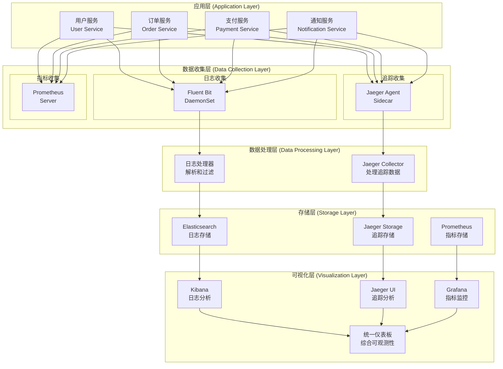
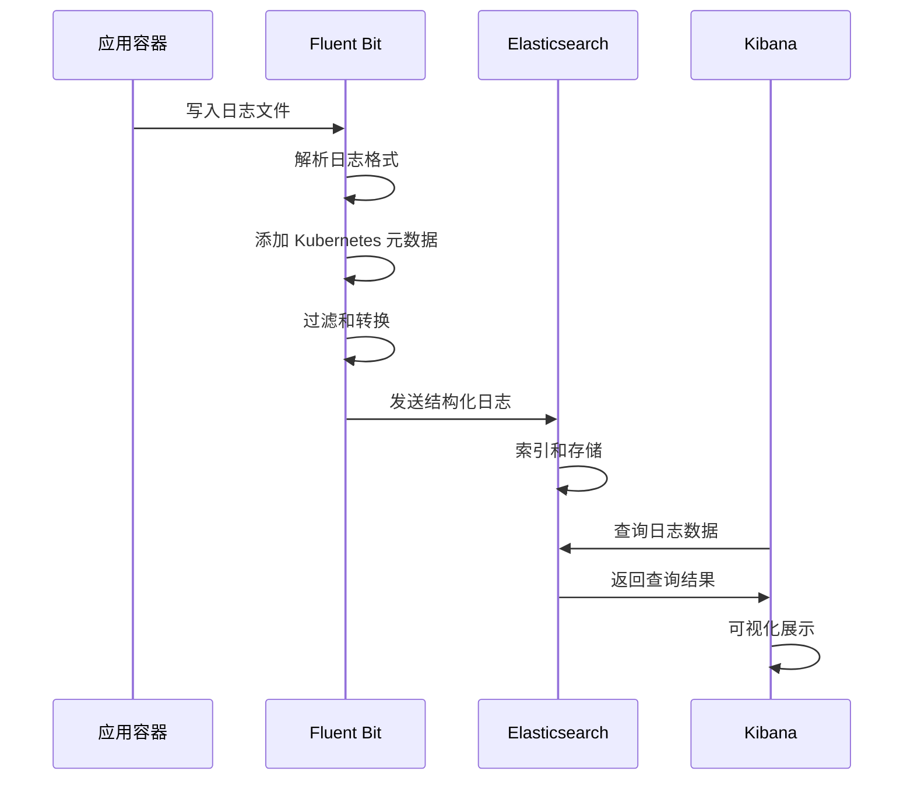
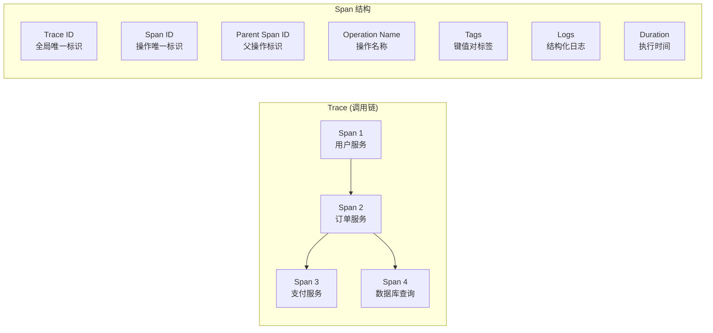
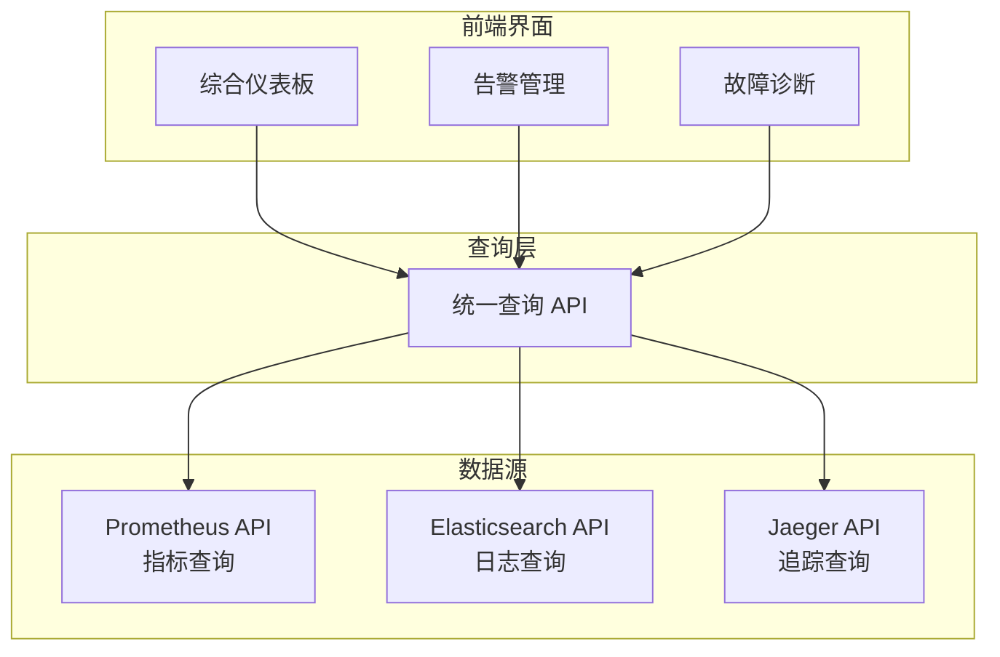

# 🏗️ 日志收集与链路追踪系统架构设计

> 深入理解云原生可观测性系统的架构原理和设计思路

## 📋 架构概述

本项目实现了一个完整的云原生可观测性解决方案，整合了指标监控（Prometheus）、日志收集（EFK Stack）和分布式链路追踪（Jaeger）三大支柱，为微服务应用提供全方位的可观测性能力。

## 🎯 设计原则

### 1. 可观测性三大支柱
- **Metrics（指标）**: 数值化的性能和业务指标
- **Logs（日志）**: 离散的事件记录和错误信息
- **Traces（追踪）**: 分布式系统中的请求调用链

### 2. 架构设计原则
- **高可用性**: 组件冗余和故障转移
- **可扩展性**: 水平扩展和负载均衡
- **低侵入性**: 最小化对应用的影响
- **统一管理**: 集中化的配置和监控

## 🏗️ 整体架构



## 📊 EFK 日志收集架构

### 组件说明

#### Elasticsearch
- **角色**: 分布式搜索和分析引擎
- **功能**: 日志数据存储、索引、搜索
- **部署**: 3节点集群（Master、Data、Ingest）
- **存储**: 基于时间的索引分片策略

#### Fluent Bit
- **角色**: 轻量级日志收集器
- **功能**: 日志收集、解析、过滤、转发
- **部署**: DaemonSet（每个节点一个实例）
- **配置**: 支持多种输入源和输出目标

#### Kibana
- **角色**: 数据可视化和分析平台
- **功能**: 日志查询、仪表板、告警
- **部署**: 单实例或多实例负载均衡
- **集成**: 与 Elasticsearch 深度集成

### 数据流程



## 🔍 Jaeger 链路追踪架构

### 组件说明

#### Jaeger Agent
- **角色**: 本地追踪数据收集器
- **功能**: 接收应用发送的 Span 数据
- **部署**: Sidecar 或 DaemonSet
- **协议**: UDP（高性能）或 HTTP

#### Jaeger Collector
- **角色**: 追踪数据处理服务
- **功能**: 验证、索引、存储 Span 数据
- **部署**: 无状态服务，支持水平扩展
- **存储**: 支持多种后端存储

#### Jaeger Query
- **角色**: 查询服务和 Web UI
- **功能**: 追踪数据查询和可视化
- **部署**: 无状态服务
- **API**: RESTful API 和 gRPC

#### Jaeger Storage
- **角色**: 追踪数据存储后端
- **选项**: Elasticsearch、Cassandra、Kafka
- **配置**: 本项目使用 Elasticsearch 统一存储

### 追踪数据模型



## 🔗 数据关联和集成

### 关联策略

#### 1. Trace ID 关联
```yaml
# 日志中包含 Trace ID
{
  "timestamp": "2024-01-15T10:30:00Z",
  "level": "INFO",
  "message": "Processing order",
  "trace_id": "abc123def456",
  "span_id": "789xyz012",
  "service": "order-service"
}
```

#### 2. 时间窗口关联
- 基于时间戳的数据关联
- 支持时间范围查询
- 跨系统时间同步

#### 3. 服务标识关联
- 统一的服务命名规范
- 一致的标签和元数据
- 服务拓扑映射

### 统一查询接口



## 🚀 部署架构

### Kubernetes 部署策略

#### 命名空间隔离
```yaml
# 日志系统
namespace: logging
  - elasticsearch
  - fluent-bit
  - kibana

# 追踪系统  
namespace: tracing
  - jaeger-collector
  - jaeger-query
  - jaeger-agent

# 监控系统
namespace: monitoring
  - prometheus
  - grafana
  - alertmanager
```

#### 资源配置
```yaml
# Elasticsearch 集群
resources:
  master_nodes: 3
  data_nodes: 3
  memory: 4Gi per node
  storage: 100Gi per node

# Jaeger 组件
resources:
  collector: 2 replicas, 1Gi memory
  query: 2 replicas, 512Mi memory
  agent: DaemonSet, 256Mi memory

# Fluent Bit
resources:
  daemonset: 256Mi memory per node
  cpu_limit: 200m per pod
```

## 📈 性能和扩展性

### 性能优化

#### 日志收集优化
- 异步批量发送
- 本地缓冲和重试
- 压缩传输
- 采样和过滤

#### 追踪性能优化
- 智能采样策略
- 异步数据发送
- 本地聚合
- 批量处理

#### 存储优化
- 索引生命周期管理
- 数据压缩和归档
- 分片和副本策略
- 查询缓存

### 扩展性设计

#### 水平扩展
- 无状态服务设计
- 负载均衡
- 自动伸缩
- 分布式存储

#### 垂直扩展
- 资源配额管理
- 性能监控
- 容量规划
- 瓶颈识别

## 🔒 安全性考虑

### 数据安全
- 传输加密（TLS）
- 存储加密
- 访问控制（RBAC）
- 数据脱敏

### 网络安全
- 网络策略隔离
- 服务间认证
- API 访问控制
- 审计日志

## 📊 监控和告警

### 系统监控
- 组件健康状态
- 资源使用情况
- 性能指标
- 错误率统计

### 业务监控
- 数据收集延迟
- 查询响应时间
- 存储使用量
- 用户访问模式

---

**这个架构设计为您提供了构建生产级可观测性系统的完整蓝图！** 🏗️

接下来查看 [部署指南](./DEPLOYMENT_GUIDE.md) 了解具体的部署步骤。
